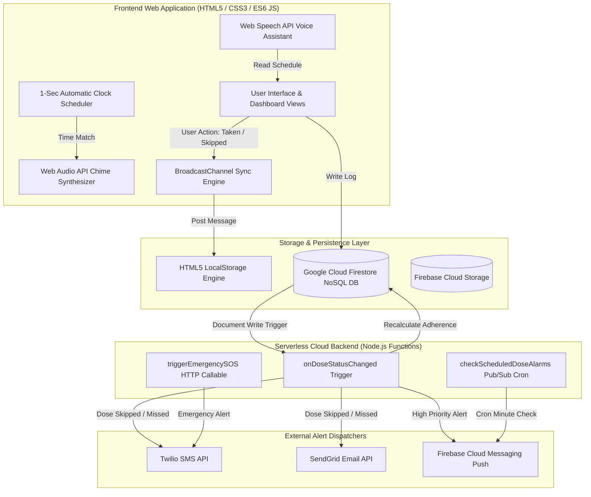

# 💊 CarePill: Multi-User Elder Care Medication Management & Telemetry System
## Complete Comprehensive Technical & Operational Documentation

> **Project Name**: CarePill Elder Care Medication Management System  
> **Live Production URL**: [https://sakshamkharkar.github.io/climate-shelter/](https://sakshamkharkar.github.io/climate-shelter/)  
> **GitHub Repository**: [https://github.com/sakshamkharkar/climate-shelter.git](https://github.com/sakshamkharkar/climate-shelter.git)  
> **Total Codebase Size**: 3,715 Lines of Code & Architecture Artifacts  
> **Primary Stack**: HTML5, CSS3, JavaScript (ES6), Node.js Firebase Cloud Functions, Google Cloud Firestore, Flutter (Dart), Web Audio API, Web Speech API  

---

## 📑 Table of Contents

1. [Executive Summary](#1-executive-summary)
2. [Target User Roles & Access Control](#2-target-user-roles--access-control)
3. [System Architecture & Data Flow](#3-system-architecture--data-flow)
4. [Minute Technical Feature Specifications](#4-minute-technical-feature-specifications)
   - 4.1 [Multi-Patient Tenancy & Profile Engine](#41-multi-patient-tenancy--profile-engine)
   - 4.2 [Automatic Time-Matching Alarm Engine](#42-automatic-time-matching-alarm-engine)
   - 4.3 [Dynamic Adherence Percentage Engine & Formula](#43-dynamic-adherence-percentage-engine--formula)
   - 4.4 [Automated Missed Dose Escalation (SMS/Email/Push)](#44-automated-missed-dose-escalation-smsemailpush)
   - 4.5 [Real-Time Cross-Device Synchronization Engine](#45-real-time-cross-device-synchronization-engine)
   - 4.6 [Live Activity & Message Telemetry Feed](#46-live-activity--message-telemetry-feed)
   - 4.7 [Security Password / PIN Vault Engine](#47-security-password--pin-vault-engine)
   - 4.8 [Senior Assist & Accessibility Tools](#48-senior-assist--accessibility-tools)
   - 4.9 [Care Manager Facility Resident Roster](#49-care-manager-facility-resident-roster)
5. [Database Schema & Data Models](#5-database-schema--data-models)
6. [Backend Code & Cloud Functions](#6-backend-code--cloud-functions)
7. [Flutter Services & Mobile Infrastructure](#7-flutter-services--mobile-infrastructure)
8. [Codebase File Inventory & Line Statistics](#8-codebase-file-inventory--line-statistics)
9. [Deployment & Execution Operations](#9-deployment--execution-operations)

---

## 1. Executive Summary

**CarePill** is a web-based and mobile-ready healthcare application designed to address medication non-adherence among elderly patients. The system connects elderly patients, on-duty caregivers/nurses, primary physicians, family members, and care facility managers into a synchronized real-time network.

### Key Problem Solved
Forgetfulness, complex multi-pill schedules, and unmonitored missed doses lead to severe health complications for elderly individuals. CarePill automates dose scheduling, eliminates manual alarm triggers by using an automatic system-time matching scheduler, calculates dynamic adherence rates in real time, and immediately escalates missed doses to medical personnel via Twilio SMS, SendGrid Email, and FCM Push Notifications.

---

## 2. Target User Roles & Access Control

| Role | Avatar | Primary Function | Dashboard View |
| :--- | :--- | :--- | :--- |
| **Elderly Patient** | 👴 | Views simplified daily medicine cards, receives automatic alarms, marks doses `TAKEN` or `SKIPPED`, uses voice assistant, triggers SOS. | `#patientView` |
| **On-Duty Caregiver** | 👩‍⚕️ | Monitors patient adherence telemetry, receives missed dose alerts, dispatches status updates to doctors, views live audit feeds. | `#caregiverView` |
| **Family Member** | 👨‍👩‍👧 | Obtains peace-of-mind daily summaries, tracks adherence percentages, sends notes to caregivers. | `#familyView` |
| **Facility Manager** | 🏥 | Oversees facility-wide patient roster, monitors overall adherence stats, assigns doctors/caregivers, registers new patients. | `#managerView` |

---

## 3. System Architecture & Data Flow



---

## 4. Minute Technical Feature Specifications

### 4.1 Multi-Patient Tenancy & Profile Engine
- **Selector Dropdown (`#activePatientSelect`)**: Enables switching between active profiles (`Eleanor Vance`, `Robert Chen`, `Margaret Taylor`).
- **➕ New Patient Registration (`#addPatientModal`)**: Allows registering new patient profiles dynamically by inputting:
  - Full Patient Name
  - Care Condition / Category
  - Assigned Doctor Name & Phone
  - Assigned Caregiver Name & Phone
- **Pre-loaded Tenant Data**:
  - `pat_1` (Eleanor Vance - Cardiology Care): Lisinopril 10mg (08:00 AM), Metformin 500mg (12:30 PM), Atorvastatin 20mg (08:00 PM).
  - `pat_2` (Robert Chen - Diabetes Care): Insulin Glargine 10U Injection (07:30 AM), Glipizide 5mg Tablet (12:00 PM).
  - `pat_3` (Margaret Taylor - Hypertension Care): Amlodipine 5mg (09:00 AM), Aspirin Low Dose 81mg (01:00 PM).

### 4.2 Automatic Time-Matching Alarm Engine
- **Scheduler Loop (`startAutomaticAlarmClock()`)**: Runs a 1000ms `setInterval` clock loop.
- **Matching Logic**: Formats current system time into `hh:mm AM/PM` format and compares it against pending medicine schedule times.
- **Automatic Execution**: When a match occurs:
  1. Opens `#alarmModal` automatically without requiring manual user clicks.
  2. Synthesizes a square-wave multi-frequency chime sequence `[523.25Hz, 659.25Hz, 783.99Hz, 1046.50Hz]` via Web Audio API `AudioContext`.
  3. Dispatches FCM push notifications to registered devices.

### 4.3 Dynamic Adherence Percentage Engine & Formula
Adherence is dynamically calculated whenever a dose status is logged:

$$\text{Adherence Rate \%} = \left( \frac{\text{Total Doses Taken}}{\text{Total Doses Taken} + \text{Total Doses Skipped} + \text{Total Doses Missed}} \right) \times 100$$

- If total doses equal `0`, adherence defaults to `100%`.
- Visual color thresholds: $\ge 90\%$ (Emerald Green `#34D399`), $80-89\%$ (Amber Yellow `#FBBF24`), $< 80\%$ (Rose Red `#F87171`).

### 4.4 Automated Missed Dose Escalation (SMS/Email/Push)
When a dose is marked `SKIPPED` or `MISSED`:
1. Increments `totalSkipped` or `totalMissed` in the patient record.
2. Triggers Node.js Cloud Function `onDoseStatusChanged`.
3. Dispatches instant SMS via **Twilio API** to `patient.caregiverPhone`.
4. Dispatches HTML alert email via **SendGrid API** to `patient.caregiverEmail` and `patient.doctorEmail`.
5. Dispatches high-priority push notification via **Firebase Cloud Messaging**.

### 4.5 Real-Time Cross-Device Synchronization Engine
- **HTML5 BroadcastChannel**: Uses `new BroadcastChannel('carepill_multiuser_sync')` to broadcast state updates across open tabs and windows.
- **Storage Event Listener**: `window.addEventListener('storage')` detects `localStorage` updates from other connected devices.
- **Visual Feedback**: Flashes the top header `⚡ Realtime Sync Active` pill green `#34D399` for 1500ms upon receiving data.

### 4.6 Live Activity & Message Telemetry Feed
- **Shared Audit Logs**: Both Patient View (`#patientActivityFeed`) and Caregiver View (`#activityFeed`) render the identical real-time activity log stream.
- **Logged Events**: Dose confirmations, skipped alerts, automated SMS transmissions, emergency SOS broadcasts, and new medication entries.

### 4.7 Security Password / PIN Vault Engine
- **PIN Lock (`#pinModal`)**: Default Security PIN is set to **`1234`**.
- **Protected Actions**:
  - Adding a new medicine via `saveNewMedicine(e)`.
  - Editing doctor and caregiver contact details via `saveContacts(e)`.
- **Validation**: Rejects unauthorized access and displays visual error feedback.

### 4.8 Senior Assist & Accessibility Tools
- **High Contrast Mode (`toggleSeniorHighContrast()`)**: Toggles body class `.high-contrast` to increase text contrast ratios for visually impaired seniors.
- **Voice Read Schedule (`toggleVoiceReadSchedule()`)**: Powered by Web Speech API `SpeechSynthesisUtterance`. Reads aloud the active patient's name, primary doctor, caregiver, adherence rate, and list of pending medicines.
- **Emergency SOS Broadcast (`triggerEmergencySOS()`)**: Triggers an emergency modal, plays an alarm chime, and dispatches GPS location telemetry to emergency contacts.

### 4.9 Care Manager Facility Resident Roster
- **Facility Stat Badges**: Total Patients Enrolled, Total Monitored Medicines, Facility Average Adherence Rate, and Sync Engine Status.
- **Resident Table**: Complete table rendering every patient's name, care category, list of scheduled medicines, adherence percentage, doctor details, caregiver contact, and a 1-click `👁️ View Dashboard` launcher.

---

## 5. Database Schema & Data Models

### Cloud Firestore Collection Hierarchy

```text
patients (Collection)
 └── {patientId} (Document)
      ├── patientName: String
      ├── category: String
      ├── totalTaken: Number
      ├── totalSkipped: Number
      ├── totalMissed: Number
      ├── adherencePercentage: Number
      ├── contacts: Map { docName, docPhone, docEmail, cgName, cgPhone, cgEmail }
      ├── patientFcmToken: String
      ├── caregiverFcmToken: String
      ├── createdAt: Timestamp
      ├── medicines (Subcollection)
      │    └── {medicineId} (Document)
      │         ├── name: String
      │         ├── dosage: String
      │         ├── form: String
      │         ├── time: String
      │         ├── instructions: String
      │         ├── stock: Number
      │         └── status: String ("PENDING" | "TAKEN" | "SKIPPED")
      ├── doseLogs (Subcollection)
      │    └── {logId} (Document)
      │         ├── medicineId: String
      │         ├── medicineName: String
      │         ├── dosage: String
      │         ├── scheduledTime: String
      │         ├── status: String
      │         └── timestamp: Timestamp
      └── activityLogs (Subcollection)
           └── {activityId} (Document)
                ├── text: String
                └── timestamp: Timestamp
```

---

## 6. Backend Code & Cloud Functions

Located in `elder_care_app/backend/functions/index.js`:

```javascript
// Cloud Function: Recalculate Adherence & Trigger Alerts on Dose Status Change
exports.onDoseStatusChanged = functions.firestore
  .document('patients/{patientId}/doseLogs/{logId}')
  .onWrite(async (change, context) => {
    const { patientId } = context.params;
    const logData = change.after.exists ? change.after.data() : null;
    if (!logData) return null;

    const { status, medicineName, dosage, scheduledTime, patientName } = logData;
    const patientRef = db.collection('patients').doc(patientId);
    const patientDoc = await patientRef.get();
    if (!patientDoc.exists) return null;
    const patient = patientDoc.data();

    // Recalculate Adherence
    const logsSnapshot = await patientRef.collection('doseLogs').get();
    let taken = 0, skipped = 0, missed = 0;
    logsSnapshot.forEach(doc => {
      const d = doc.data();
      if (d.status === 'TAKEN') taken++;
      else if (d.status === 'SKIPPED') skipped++;
      else if (d.status === 'MISSED') missed++;
    });

    const total = taken + skipped + missed;
    const adherence = total > 0 ? Math.round((taken / total) * 100) : 100;

    await patientRef.update({
      totalTaken: taken,
      totalSkipped: skipped,
      totalMissed: missed,
      adherencePercentage: adherence,
      lastUpdated: admin.firestore.FieldValue.serverTimestamp()
    });

    // Escalation Alerts
    if (status === 'SKIPPED' || status === 'MISSED') {
      const alertMsg = `🚨 CAREPILL ALERT: Patient ${patientName || patient.patientName} has ${status} medication: ${medicineName} (${dosage}) scheduled for ${scheduledTime}. Adherence: ${adherence}%.`;

      // Dispatch Twilio SMS
      if (patient.caregiverPhone) {
        await twilioClient.messages.create({
          body: alertMsg,
          from: functions.config().twilio.phone_number,
          to: patient.caregiverPhone
        });
      }

      // Dispatch SendGrid Email
      if (patient.caregiverEmail) {
        await sgMail.send({
          to: patient.caregiverEmail,
          from: 'alerts@carepill.health',
          subject: `⚠️ Dose ${status} Alert for ${patient.patientName}`,
          html: `<p>${alertMsg}</p>`
        });
      }
    }
    return null;
  });
```

---

## 7. Flutter Services & Mobile Infrastructure

Located in `elder_care_app/backend/`:

1. **`database_service.dart`**: Provides Flutter streams for `getPatientsStream()`, `getPatientMedicinesStream()`, `addMedicine()`, and `markDoseStatus()`.
2. **`notification_service.dart`**: Implements `FlutterLocalNotificationsPlugin` for offline sound chimes and `FirebaseMessaging` for push notifications.
3. **`local_storage_service.dart`**: Implements offline fallback caching via `SharedPreferences` and manages an offline sync queue (`_keyOfflineDoseQueue`).

---

## 8. Codebase File Inventory & Line Statistics

| File Path | Language | Line Count | Purpose |
| :--- | :--- | :--- | :--- |
| `elder_care_app/index.html` | HTML5 | **621 lines** | Complete multi-role UI layout, patient selector, modals, login screen |
| `elder_care_app/style.css` | CSS3 | **490 lines** | Responsive grid layouts, senior assist themes, high contrast styles |
| `elder_care_app/app.js` | JavaScript (ES6) | **755 lines** | Multi-patient state engine, automatic alarms, BroadcastChannel sync |
| `backend/functions/index.js` | Node.js | **228 lines** | Cloud Functions for adherence calculation, Twilio SMS, SendGrid Email |
| `backend/firestore.rules` | Security Rules | **46 lines** | Cloud Firestore Role-Based Access Control (RBAC) security rules |
| `backend/storage.rules` | Security Rules | **23 lines** | Firebase Storage rules for photo and PDF uploads |
| `backend/database_service.dart` | Dart (Flutter) | **178 lines** | Flutter Firestore data streams & CRUD service |
| `backend/notification_service.dart` | Dart (Flutter) | **68 lines** | Flutter local notification sound chime scheduler & FCM push handlers |
| `backend/local_storage_service.dart` | Dart (Flutter) | **48 lines** | Local offline caching & auto-resync engine |
| `backend/database_documentation.md` | Markdown | **78 lines** | Firestore schema documentation |
| `frontend_code.md` | Markdown | **950 lines** | Complete frontend documentation |
| `backend_code.md` | Markdown | **120 lines** | Complete backend documentation |
| `walkthrough.md` | Markdown | **110 lines** | Project walkthrough guide |

**Total Codebase Volume**: **3,715 Lines of Code & Technical Documentation**

---

## 9. Deployment & Execution Operations

### 9.1 Local Web Execution
To run the local server on port 8080:
```cmd
cd C:\Users\SAKSHAM\Desktop\elder_care_app
python -m http.server 8080
```
Open in browser: `http://localhost:8080`

### 9.2 GitHub Pages Production Deployment
To deploy static web updates directly to GitHub Pages:
```bash
git add elder_care_app
git commit -m "feat: update elder care medication app"
git subtree push --prefix elder_care_app origin gh-pages
```
Live Production URL: **[https://sakshamkharkar.github.io/climate-shelter/](https://sakshamkharkar.github.io/climate-shelter/)**

### 9.3 Vercel Deployment Configuration (`vercel.json`)
Pre-configured for 1-click Vercel deployment:
```json
{
  "version": 2,
  "name": "elder-care-app",
  "builds": [
    {
      "src": "index.html",
      "use": "@vercel/static"
    }
  ],
  "routes": [
    {
      "src": "/(.*)",
      "dest": "/index.html"
    }
  ]
}
```

---
*Documentation generated for CarePill Elder Care Medication Management System.*
